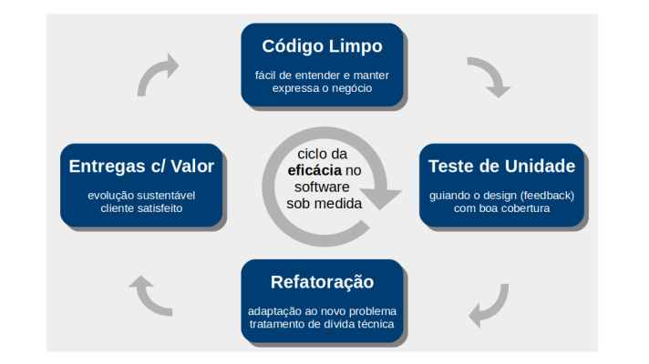

# Clean Code (Udemy)
Este projeto é parte integrante do curso disponibilizado na Udemy sobre o livro "Clean Code" (Robert C. Martin).

Para maiores informações acesse o [curso na Udemy](https://www.udemy.com/course/clean-code-na-pratica/?referralCode=24F598EE94626485768C)

## Clean Code
“Clean Code” é uma filosofia, um guia ou conjunto de boas práticas para escrever código de forma que ele possa ser lido e entendido por outros programadores.

Github do [curso](https://github.com/refactown/cleancode/tree/master/src/main/java/refactown/cleancode).



- Pequenas Coisas Importam: "Quem não faz bem as pequenas coisas, não faz bem coisa alguma". Nomenclatura, padrões, formatação, comentários, etc, devem ser valorizados. Essas pequenas tarefas, ao longo do tempo, garantirão a manutenção desta produtividade.
- Código é Requisito Detalhado. O Código fonte é detalhamento dos requisitos e deve expressar o negócio.
- Comunique, não Codifique. Código deve ser feito para ser lido por outra pessoa, deve ser legível, não apenas por máquinas.
- Código ruim gera baixa produtividade que gera código pior.

*Atitude:*
- "Regra do escoteiro". Ao acampar os escoteiros levam bagagens, e ao partir do camping ele leva o lixo que produziu e também o lixo que já estava antes no local. Essa é uma boa prática, tentar deixar o código um pouco melhor do que o estado em que foi econtrado, toda oportunidade de alterar um código é uma boa oportunidade de deixá-lo melhor.

Artigos:
[Dívida Tecnica](https://artesoftware.com.br/2019/02/10/divida-tecnica/)
[Introdução a Clean Code](https://artesoftware.com.br/2020/08/02/clean-code/)
[The CLean Code Blog. Robert C. Martin](https://blog.cleancoder.com/uncle-bob/2014/06/20/MyLawn.html)

## Conceitos /  Boas Práticas

### DDD
Do negócio ao código via Domain Driven Design. Separar o que é do negócio do que é da tecnologia.
- O requisito está no código, o domínio de um problema organiza os conceitos sobre os quais é baseada a solução de software.
- Foco no Negócio. Parte do código deve expressar o negócio.
- Isolamento do Domínio. O código de domínio é idiossincrático (próprio, específico) e particular.
- Infraestrutura à Parte. Tecnologias vêm e vão, o negócio permanece.

Recomenda-se a separação em camadas: User Interface, Application, Domain, Infrastructure.

**Vocabulário**
- Linguagem Onipresente (Ubíqua). Presente na fala de todos e no código de domínio, não deixa dúvidas, são termos usados pelos desenvolvedores e pelos especialistas de negócio.
- Contexto Delimitado. Partes bem delimitadas de um domínio, pois é possível que esteja-se trabalhando em um negócio muito grande. Candidatos a microserviços.
- Tijolos de Construção. Entidades, Objetos de Valor, Eventos de Domínio, Serviços, Fábricas, Repositórios.

## Princípio da Responsabilidade Única (SRP)
"Cada módulo de um software deve ter um e apenas um motivo para mudar". <br>
Ele deve ser responsável por uma funcinalidade apenas. Se ele estiver responsável por mais, na alteração de uma das funcionalidades é possível que haja impactos nas demais. Torna-se necessária a compreensão de mais fluxos e regras de negócio além do necessário.

Resumindo: Um pedaço de código faz UMA FUNCIONALIDADE.

## Princípio da Não Repetição (DRY)
`Don't Repeat Yourself (DRY)`, não se repita (código, requisito, teste, etc). Não repita código em lugares diferentes.<br>
Toda parte do conhecimento deve ter uma `representação única` e livre de ambiguidades em todo o sistema.

Resumindo: Uma funcionalidade existe em apenas UM LOCAL do código.

Problemas:
- Mais trabalho: alterar mais vezes
- Mais risco: encontrar todos os lugares em que se deve alterar
- Mais teste: testar várias vezes a mesma coisa
- Mais esforço de comunicação. Fu

## Indireção ou Delegação

Forma de evitar duplicação de código e manter uma responsabilidade única em um trecho de código. Exemplo:


## Lei de Demeter (Princípio do Menor Conhecimento)

Um módulo não deve enxergar o interior dos objetos que ele manipula.

Um método "m" de uma classe "C" só deve chamar:
- Objetos do tipo "C"
- Parâmetros passados para o método "m" (ex. "x: P")
- Um objeto criado pelo próprio método "m"
- Variáveis de instância da classe "C" (ex. "a: A")

Deve-se evitar Train Wreck (Acidente de Trem): x.getY().getZ().


## Acoplamento e Coesão

Coesão de uma classe:
- Poucas variáveis de instância
- Cada método manipula uma ou mais

Alto Acoplamento | Baixa Coesão:
- Poucas classes e grandes
- Maior dependência por classe (imports). A alteração em um ponto pode interferir em *n* funcionalidades
- Maior conhecimento entre elementos

Baixo Acoplamento | Alta Coesão (desejado): :star:
- Muitas classes e pequenas
- Menos dependência por classe
- Menor conhecimento

## Imutabilidade

**Quanto mais imutável melhor.**
Evite Surpresas: Imutabilidade é uma defesa contra "efeitos colaterais", já que pode haver manipulação indesejada no objeto. Havendo manipulação deve haver a verificação se algo foi alterado em algum momento, isso também deixa de ser necessário.

`private final int idade;`

Vantagens:
- Mais seguro e confiável
- Mais legível: minimiza testes e garantias, diminui o código por tabela
- Paralelismo e escalabilidade

## Funções Puras (em Orientação a Objetos)
Produz mais simplicidade de leitura.
Função Pura:
1. Para um certo Input sempre retorna o mesmo Output.
2. Não causa nenhum efeito colateral, não impacta nada além do escopo da própria função.
3. Não depende de nenhum dado externo (autocontida), deve ser simples, objetiva, como uma função soma, poucas entradas e saídas.

Vantagens:
- Mais simples e menores
- Mais fácil de entender e testar

**Quando usar em código OO?**
Sempre que possível. Em muitas situações não é possível: BD (acesso a dado externo, efeito colateral), integração, estados, etc.
Possível em regras de negócio, métodos utilitáeios

## Testes de Unidade Tempestivos
Teste Tempestivo

**TDD - Test Driven Development**
Desenvolvimento Guiado por Testes, ação de desenvolvimento. O teste é feito primeiro e depois o código para satisfazer o teste.
- Escreve um teste que falha antes do código produtivo
- Faz o teste passar ao construir o código produtivo
- Refatora o código até o teste falhar (ou não)

**Testes Tempestivos (TDD inclusive)**
Teste que ajuda na construção, logo, cedo.
1. Atividade de engenharia (código e design)
2. Feedback rápido sobre o código testado (erra cedo)
3. Gera código limpo através da "dificuldade" de testar
4. Antecida o custo gasto em correções e debug
5. Ainda serve como teste de regressão

Duas pernas do Clean Code, teste unitário e refatoração.

## Refatoração Tempestiva
*"Refatoração (refactoring) é a disciplina técnica para reestruturar um determinado código, alterando sua estrutura interna `sem mudar seu comportamento externo`".* Martin Fowler

Refatoração não é reengenharia. Por exemplo alteração de um método que recebia um parâmetro e vai passar a receber três.

Refatoração é ágil, são pequenas mudanças que fazem diferença no longo prazo. Ajuste da solução em função de uma nova visão sobre o problema, ou para preparar uma evolução ou mudança.

O primeiro código possivelmente não é o melhor possível, o mais expressivo, ou cumpre todos os princípios.


## As 4 regras da Simplicidade (Martin Fowler/ Kent Beck)
1. Alta cobertura de testes. Todos os testes passam.
2. Revela a Intenção, o próprio código explica o que ele faz, sem auxílio de explicação.
3. Nenhuma duplicação
4. Mínimo de Elementos, fazer as três primeiras regras com o mínimo possível.


## Revisão dos conceitos


### Filosofia sobre código Limpo (Visão Geral)

 - O código não fica nem se mantém limpo sozinho
 - `Todos` na equipe devem praticar e cobrar
 - Manter o código limpo é uma `atividade diária`, não deixar acumular
 - Funciona como na "Teoria das janelas quebradas", quando algo está bem tratado a tendência é continuar tratando bem, quando está mal tratada a tendência é tratar pior no decorrer do tempo.
 - `Atitude` é mais relevante do que "patrocínio", a atitude muitas vezes conta mais do que o tempo devido pela sprint, cobrança da liderança.
 - Sempre dá pra começar (regra do escoteiro)
 - Ler e entender consome mais tempo que escrever
 - Precisa de `tempo, técnica e treino` ára fazer bem

### Filosofia sobre Nomes

Exemplo de código ruim em [c02names/BadCode](src/main/java/refactown/cleancode/c02names/BadCode.java).
E refatoração em em [c02names/Refactoring](src/main/java/refactown/cleancode/c02names/Refactoring.java).

 - Nomes são muito importantes (especialmente em OO)
 - Use nomes que `revelam seu propósito`, evite nomes não pronunciáveis
 - Evite informações erradas(ex.: "itemList: Map", um map com nome de list)
 - Faça distinções significativas (evite a1, a2, a3, n)
 - Nomes `pronunciáveis` e `passíveis de busca`
 - Evite codificações, por exemplo notação húngara (strNome, intIdade) e similares
 - `classes` = substantivos, `métodos` = verbos
 - Selecione uma palavra por conceito (get, set, find)
 - Nomes do `problema` (pedido, item, restaurante, relacionados à domínnio) e da `solução` (DAO, Repository, Mapper), ex.: OrderMapper, OrderMapper, ItemService
 - Adicione ou evite contexto quando necessário. Contexto desnecessário no exemplo: `EnderecoDoCliente enderecoDeCobrancaDoCliente=new EnderecoDoCliente();`
 - Evite `números mágicos`, valores numéricos inseridos no meio do código e não são inseridos em uma variável com nome descritivo. Deve-se criar uma constante para o número mágico, sendo passível de busca e rastreio no código.

#### Código Ruim (Nomes)

Exemplo de código ruim em [megasena/MegaSenaV0](src/main/java/refactown/cleancode/megasena/MegaSenaV0.java).
Em [megasena/MegaSenaV3](src/main/java/refactown/cleancode/megasena/MegaSenaV3.java) já se tem uma nomenclatura mais descritiva, funções separadas para cada atividade, utilização do stream em local do for, recurso mais novo do java, formatação.

**Problemas**
 - Nomes ruins
 - Função grande e complexa (SRP)
 - Comentários questionáveis
 - Formatação inexistente

**Dificuldades**
 - Legibilidade: confuso
 - Testabilidade: alta complexidade

### Filosofia sobre Comentários
"Qualquer um pode escrever código que o computador entenda. Bons programadores escrevem códigos que os humanos entendem". *Martin Fowler*

 - Comentários são a última opção do programador.
 - O programador deve expressar-se no código.
 - Comunique, não codifique (outros devem ler).
 - Comentário pode estar compensando código ruim.
 - Alguns comentários são bons ou necessários. 

Evitar:
 - comentários ruidosos, muito longos ou repettivos
 - Imperativos (i.e em todas as funções)
 - Marcadores de posição ////////// ou ********
 - Comentários em HTML no meio do código Java
 - Cabeçalhos de funções (prefira um bom nome)
 - Javadoc em código não público

Resumindo: Comentário é o último recurso.
Exemplo de código em [c0comments/Comments](src/main/java/refactown/cleancode/c04comments/Comments.java).

### Filosofia sobre Formatação

 - Atenção ao "code convention" da linguagem
 - O projeto deve ter um "code style" (bom ou ruim)
 - Qualquer "code style" é melhor que nenhum
 - A formatação automática evita muitas brigas
 - Formatação vertical: metáfora do jornal (leitura de cima para baixo, do mais geral para mais específico), distância vertical, espaçamento e continuidade vertical.
 - Formatação horizontal: Identação, espaçamento e continuidade horizontal. Pular linha quando se completa um raciocínio.
     - Variáveis de instância: antes dos métodos
     - Declaração de variável: atribuição, o mais próximo possível de onde será usada
     - Funções dependentes: verticalmente próximas
     - Afinidade Conceitual: mesma convenção de nomes atuam na mesma tarefa devem ficar próximas
 - Deixe a IDE trabalhar: espaçamentos automáticos, identação padrão, quebras de linha

Evitar:
 - Espaçamentos manuais
 - Mais de 120 caracteres por linha (estar atento ao code style da equipe, interessante caber na tela)

Resumindo: Seguir "code convention" da linguagem e manter a paz com a equipe combinando com os demais.

### Funções

 - Funções devem ser *pequenas* (<= 20 linhas)
 - Funções devem fazer apenas <b>uma coisa</b>
    - É melhor ler e entender uma coisa de cada vez
    - É melhor testar uma coisa de cada vez
 - Devem ter nomes descritivos do que fazem
 - Somente <b>um nível de abstração</b> por função
    - Abstração, capacidade de separar o essencial do não essencial
    - Fazer uma ação principal, um nivel de abstração como a função calculaPremio() em [MegaSenaV5](src/main/java/refactown/cleancode/megasena/MegaSenaV5.java)
    - Fazer <b>indireção</b>, delegando a um segundo nivel de abstração como as funções isApostaValida() e calculaAcertos() em [MegaSenaV5](src/main/java/refactown/cleancode/megasena/MegaSenaV5.java)
    - Cada conceito em seu lugar apropriado.
 - Funções devem ter poucos parâmetros.
 - Prefira <b>exceções</b> a retorno de códigos de erro.
   
 - Efeitos colaterais devem ser evitados ao máximo, deve manipular atributos apenas de dentro do escopo da função.
 - Quanto mais funções puras melhor
 - Quanto mais autocontida mais fácil de testar
 - Utilizar programação polimórfica em detrimento de programação procedural. Exemplo em [Employee](src/main/java/refactown/cleancode/c03functions/Employee.java)
 - Quantidade de parâmetros deve ser a <b>menor possível</b>. Se a quantidade de parâmetros é muito grande, pode ser usado um objeto como parâmetro, encapsulando os demais.
 - Evitar <b>parâmetro seletor</b>, ele já indica logo na assinatura que uma função faz duas coisas. Indesejado, parâmetro booleano indicando dois comportamentos. O ideal é fazer duas funções separadas.
 - Evitar <b>parâmetro de saída</b>, enviar um parâmetro que será manipulado na função e capturado posteriormente. O ideal é não passar esse parâmetro e colocar a saída como um objeto apenas no retorno.
 - As funções devem somente <b>fazer ou responder</b> algo, mas não ambos. Ou altera o estado de um objeto ou retorna informação sobre ele.
 - <b>Tratamento de erro</b> é uma coisa só. O "try" deve ser a primeira linha da função e não deve haver nada depois do fim do bloco "try/catch/finally".

<b>Evite Repetição (DRY)</b>
 - Indireção, extração etc podem gerar duplicação
 - Funções menores e especializadas requerem reúso (SRP)

<b>Faça e Refaça com Confiança</b>
 - Comece fazendo funcionar e depois refatore
 - Tenha cobertura de testes para ter confiança

<b>Funções são verbos do domínio</b>
 - Uma hierarquis de funções conta uma estória
 - Níveis de abstração ajudam na leitura da estória

### Objetos e Estrutura de Dados
Os <b>objetos</b> usam abstrações para <b>esconder seus dados</b> e <b>expõem</b> funções que operam sobre eles.
Objetos buscam menor conhecimento.
Um exemplo de Objeto é a classe [Pedido](src/main/java/refactown/cleancode/c06objects/Pedido.java).

<b>Estruturas de dados</b> <b>expõem seus dados</b> e não possuem funções significativas (get/set = acessores).
Estruturas de dados (DTO) buscam imutabilidade.
Kotlin tem uma palavra reservada para definir uma estrutura de dados: **"data"**. A sintaxe deixa clara a diferença entre uma estrutura de dados e demais classes/objetos.
Numa Estrutura de Dados não se objetiva realizar encapsulamento, polimorfismo ou comportamentos mais complexas, apenas representar as propriedades.
Um exemplo de Estrutura de Dados é a classe [PedidoDTO](src/main/java/refactown/cleancode/c06objects/PedidoDTO.java), observe que suas propriedades são imutáveis.

#### Feature Envy (Inveja de Funcionalidade)
Um objeto tem "inveja" da funcionalidade que deve ser implementada em outro objeto.
No exemplo, na classe [Pedido](src/main/java/refactown/cleancode/c06objects/Pedido.java), o primeiro IF tem inveja de um dado que deve ser fornecido pelo <b>objeto</b> Pedido.
Caso Pedido seja uma estrutura de dados, isso não seria problema.


#### Procedural x Orientado a Objetos

Há um exemplo de comparação entre abordagens Procedural e OO em [GeometryTest](src/main/java/refactown/cleancode/c06objects/book/GeometryTest.java).
Caso haja uma situação em que seja necessário adicionar vários comportamentos a solução Orienta à Objetos é mais adequada, comportamentos como: cálculo de perímetro, cálculo de área.

Caso seja necessário adicionar vários objetos para poucos comportamentos, talvez a situação mais expansível seja a Procedural, necessário análise. Exemplo de método procedural:

```java
public static double calculateArea(Object shape) {
   if (shape instanceof Square) {
      Square s = (Square)shape;
      return s.getSide() * s.getSide(); // s.side
   } else if (shape instanceof Rectangle) {
      Rectangle r = (Rectangle) shape;
      return r.getHeight() * r.getWidth(); 
   } else if (shape instanceof Circle) {
      Circle c = (Circle) shape;
      return PI * c.getRadius() * c.getRadius();
   }
   throw new IllegalArgumentException("Unknown shape class:" + shape.getClass());
})
```

#### Comparativo


Uma estrutura com apenas atributos deixa claro ser uma estrutura de dados. Em kotlin a expressão `data class` é utilizada para estrutura de dados.
Uma classe com muitos comportamentos atuando sobre suas propriedades se configura como um objeto. 

Porém é possível existir algo meio híbrido, e deve ser evitado, como em em [GeometryTest](src/main/java/refactown/cleancode/c06objects/FeatureEnvy.kt).

```kotlin
// EVITAR Classe que se confunde entre estrutura de dados e objeto
// Métodos que possíbilitam acessar o cálculo de área de forma externa
class HybridSquare(val side: Double) : Shape {
    override fun area() = side * side
}

class HybridRectangle(val height: Double, val width: Double) : Shape {
    override fun area() = height * width
}

class HybridCircle( val radius: Double) : Shape {
    override fun area() = PI * radius * radius
}
// A própria classe tem o cálculo de área
fun calculateAreaFeatureEnvy(shape: Any): Double {
    return when (shape) {
        is HybridSquare -> shape.side * shape.side
        is HybridRectangle -> shape.height * shape.width
        is HybridCircle -> PI * shape.radius * shape.radius
        else -> throw IllegalArgumentException()
    }
}
```
#### Lei de Demeter sobre Objetos.
Basicamente afirma que um objeto não deve observar o interior dos objetos que ele manipula. Aplica-se muito a objetos, e talvez não seja "bad smell" para estrutura de dados, pois há possibilidade em que ela não se aplica, por falta de opções.

Em kotlin a operação `x = a?.b?.c?.d` garante uma navegação segura pois a linguagem verifica campos nulos, evitando NullPointer Exception nesse caso. Já em java `x = a.getB().getC().getD()` seria necessário realizar três testes de nulidade, adicionando complexidade por falta de recursos na linguagem. Numa estrutura de dados isso seria possível, pela imutabilidade das sua spropriedades e a proibição de "null".

### Tratamento de Erro

 - Use <b>exceções</b> em vez de retornar códigos de erro
 - Prefira exceções não verificadas (unchecked). Mais específico para o java. Exceções *checked* obrigam o chamados do método a inserir um *try/catch*. Algo já vem sendo abandonado, exceções *unchecked* são mais indicadas, código mais limpo e não atribuem grande ganho ao sistema.
 - Forneça exceções com <b>contexto</b> e sem abafamento. Não remover dados da exceção, ou capturar uma exceção e retornar outra customizada com erro genérico.
 - Pense no design do "try-catch-finally" antes. Entenda que faz parte do código.
 - Defina exceções pensando no chamador. Como elas serão tratadas.
 - Cada "catch" deve fazer apenas uma coisa.
 - Não retorne nem passe <b>"null"</b>. No kotlin a linguagem já sugere isso dificultando criar propriedades nuláveis. Passar nullo obriga o consumidor do método tratar/verificar esse nulo.
 - Dê preferência às exceções já fornecidas pela linguagem (efective java). Por exemplo, no cálculo da megasena caso algum parâmetro esteja inválido, é indicado retornar `IlegalArgumentException` e não  `ApostaInvalida`, pois dificulta a identificação do erro.

#### Código Ruim - Exemplo 1
Em [JsonParsing](src\main\kotlin\refactown\cleancode\c07exceptions\JsonParsing.kt):

```java
fun fromJsonV0(json: String, clazz: Class<*>): Any?{
    val gson = Gson()
    try {
        return gson.fromJson(json, clazz)
    } catch (e: Exception){
        println("Parsing error. Json text:$json")
        return null
    }
}
```

<b>Problemas</b>
 - Não retorna uma exceção
 - Abafa exceção do Gson
 - Retorna "null"
 - Imprime direto no console

<b>Consequências</b>
 - Contrato baseado em "null"
 - Omissão do erro raiz (causa)
 - Força a testar nulidade
   - kotlin: `?.`
   - java: `if (result != null)
 - Log inadequado e ineficiente
  
Código de exceção mais adequado em [`fromJsonV2`](src\main\kotlin\refactown\cleancode\c07exceptions\JsonParsing.java). Teste em [JsonParsingKtTest](src\test\kotlin\refactown\cleancode\c07exceptions\JsonParsingKtTest.kt).

### Fronteiras (boundary)
 - Código de terceiro quase sempre é "infraestrutura". Onde deseja-se que seja em um módulo isolado com uma função específica, e apto a alteração de solução no futuro.
 - Infraestrutura deve ser <b>isolada</b> do negócio. Possibilidade de trabalhar na infraestrutura ou no negócio isoladamente, com menos acoplamento.
 - Testes de aprendizado são uma boa dica. Eles acabam documentando como o método funciona.


O consumidor do método chama a interface e desconhece a implementação de infraestrutura de parser do Json. Pois apenas a implementação da interface é responsável pela implementação.Boa prática.

<b>Há necessidade de criar exceção customizada?</b>
Não há uma resposta exata. De acordo com os princípios de acoplamento e simplicidade do código seria criada uma exceção JsonException, encapsulando a do Gson ou do Jackson. Pois o cliente se prepara para receber uma exceção específica independente da implementação de infraestrutura escolhida. Além de não precisar importar uma exceção específica da library Gson ou Jackson, esse importa quebraria o desacoplamento entre consumidor e infraestrutura criado anteriormente.

## Developer
Kamila Serpa

[1]: https://www.linkedin.com/in/kamila-serpa/
[2]: https://gitlab.com/java-kamila

[][1]
[][2]
